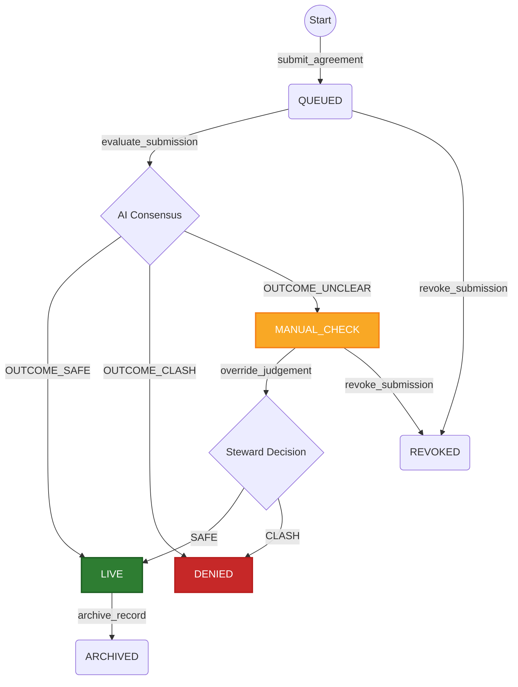

# 🛡️ DomainRiskManager (GenLayer Smart Contract)

**DomainRiskManager** is an advanced Intelligent Smart Contract deployed on the GenLayer network utilizing GenVM. It acts as a semantic registry that leverages non-deterministic AI consensus to evaluate, manage, and store commitments (e.g., promotional campaigns, exclusivity deals, resource allocation). 

The contract ensures that no material conflicts (schedule clashes, monopolies, duty breaches) exist between newly proposed agreements and already active ones within a specific domain.

---

## ✨ Key Features

*   **🤖 AI-Powered Consensus:** Utilizes GenLayer's `run_nondet_unsafe` to semantically analyze incoming text agreements against active landscape data.
*   **🔐 Permissioned Architecture:** Domain-specific whitelisting ensures only authorized addresses can submit data.
*   **⚖️ Steward Override System:** Global stewards can manually resolve deadlocks, override AI decisions, or bypass inconclusive evaluations.
*   **⚙️ Dynamic Risk Configuration:** Each domain can be configured with specific risk tolerance (`strict_mode`, `ignore_minor`).
*   **📦 Batch Processing:** Optimized gas usage by allowing batch evaluation of multiple queued submissions.
*   **📜 On-Chain Event Logging:** Built-in event ledger for seamless frontend tracking and indexing.

---

## 🏗️ State Machine Lifecycle

Submissions flow through a strict state machine:
1.  `QUEUED`: Initial state upon submission.
2.  `LIVE`: Approved by AI Consensus (no critical conflicts).
3.  `DENIED`: Rejected by AI Consensus (critical clash detected) or Steward.
4.  `MANUAL_CHECK`: AI returned an ambiguous/unclear result; requires Steward intervention.
5.  `REVOKED` / `ARCHIVED`: Post-execution states for lifecycle management.

---

## 🚀 How to Use (Step-by-Step Guide)

### Step 1: Domain Registration & Permissions
Before submitting any agreements, a domain must be registered and configured.
1. **Register Domain:** A Steward calls `register_domain(domain="my_domain", owner=0xYourAddress)`.
2. **Whitelist Users:** The Domain Owner calls `set_whitelist(domain="my_domain", account=0xTargetAddress, is_allowed=true)`.
3. *(Optional)* **Set Risk Config:** The Owner calls `configure_domain_risk(domain="my_domain", strict_mode=false, ignore_minor=true)`.

### Step 2: Submitting an Agreement
A whitelisted user proposes a new commitment.
* Call `submit_agreement(domain, body_text, bg_info, hook)`.
* **Example:** 
  * `body_text`: *"I will exclusively promote Project Alpha during October 2026."*
  * `hook`: `"0x0000000000000000000000000000000000000000"` (or a valid address implementing `IResolutionListener`).
* The contract returns a unique `submission_id`.

### Step 3: AI Evaluation (Intelligent Consensus)
Trigger the GenLayer AI consensus to evaluate the queued submission.
* Call `evaluate_submission(submission_id)`.
* Validators will semantically compare the new text against all `LIVE` agreements in that domain.
* If safe, the status changes to `LIVE`. If a conflict is found (e.g., overlapping exclusive dates), it changes to `DENIED`.

### Step 4: Reading the Results
* Call `get_submission(submission_id)` to check the current state.
* Call `get_judgement(submission_id)` to retrieve the detailed JSON rationale and a list of specific conflicts (if any) generated by the AI.

### Step 5: Steward Intervention (If needed)
If a submission gets stuck in `MANUAL_CHECK` due to AI ambiguity, a Steward can step in.
* Call `override_judgement(submission_id, force_outcome="SAFE", rationale="Manual review approved.")`.

---

## 📊 Conflict Types Detected
The AI consensus is instructed to categorize issues into the following standardized types:
* `MONOPOLY`
* `ASSET_CLASH`
* `SCHEDULE_CLASH`
* `DUTY_BREACH`
* `POWER_CLASH`
* `MISC`

## 🛠️ Technical Limits
To prevent context window bloat and excessive gas costs, the contract enforces the following limits:
* `LIMIT_MAX_ACTIVE = 5` (Max active agreements evaluated simultaneously per domain)
* `LIMIT_AGREEMENT_LEN = 1500` characters
* `LIMIT_BG_INFO_LEN = 800` characters

---
*Developed for the GenLayer Ecosystem using `py-genlayer` SDK.*

